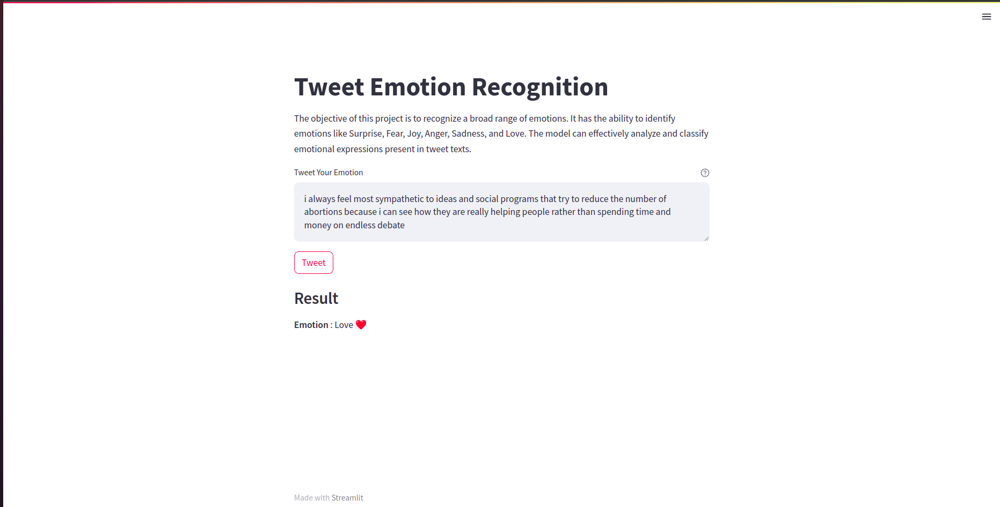

# Tweet-Emotion-Recognition
The aim of this project is to identify wide range of emotions. It has the ability to identify emotions like Surprise, Fear, Joy, Anger, Sadness, and Love. The model can effectively analyze and classify emotional expressions present in tweet texts.

<p align="center">
    
</p>

---
## Dataset
The dataset has thousands of tweets, each classified in one of six emotions.
- [Tweet Emotion Dataset](https://www.icloud.com/iclouddrive/084E9TMZ_lykn3QhU-kIX1DDQ#merged_training)


## Getting Started

1. Create a virtual environment
```
python3 -m venv venv
source venv/bin/activate
```
2. Clone the repository to your local machine
``` 
git clone https://github.com/ldebele/Tweet-Emotion-Recognition.git
cd Tweet-Emotion-Recognition
```
3. Install the required dependencies
``` 
pip3 install -r requirements.txt
``` 

4. Run the web app
``` 
streamlit run './src/app.py'
``` 

## Author
- `Lemi Debele`